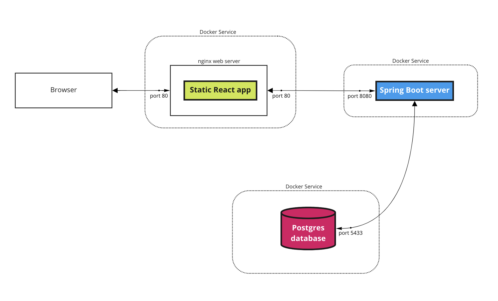

# About

Google Workspace Add-on
Application written in TypeScript and deployed to Google Apps Script platform. It’s using APIs provided by Google to create the UI, send API requests and manage the local storage.

## Purpose
The purpose of the project is to create a website and an Add-on to Google Calendar that will be available to people with a Google account. Its function will assist in scheduling meetings for groups, by automating a part of the process. The main functionality will be finding free time slots among multiple calendars. Users will be able to save their event settings as presets to later be able to quickly use them.

## Project scope
creating a Google Calendar Add-on
creating a website
the ability to read calendars of multiple users
creating events in users’ Google Calendars

## Functional requirements
* Automatically finding an available time slot based on the specified settings
* Creating a shared event between multiple users;
* Marking each meeting attendee as ‘obligatory’ or ‘non-obligatory’
* Defining the total time needed for a particular task;
* Defining between what dates the event needs to take place
* Finding free slots in the calendar that work for all obligatory participants and the most non-obligatory users
* Customize availability settings, ex: Exclude weekends, Consider only times between 08:00 AM and 04:00 PM
* Scheduling the event at the found time
* Adding additional emails to a single PlanIt user’s account
* Creating, editing and deleting a preset
* Specifying the settings that are available when normally creating an event in Google Calendar (ex. description and location)
## Non-functional requirements
* The system should be able to import database snapshots in case of failure
* The system should take hourly database snapshots
* The system architecture and functionalities are documented
* The responses from the application back-end should take less than 1s
* The system should support internationalization and a single language (English)
* The system should not spend more than 10s per 500 requests to Google

# Useful links

- [Introduction to Docker](/docs/Docker.md)
- [Miro board](https://miro.com/app/board/uXjVPVOoQV0=/)
- [Google App Script Introduction](https://developers.google.com/apps-script)
- [Google Calendar](https://calendar.google.com/)
- [AppScript](https://script.google.com/)

# Running the project locally

### React front-end

1. Install NodeJS
2. In the `frontend-react` directory execute:
   - `npm install`
   - `npm start` - starts a hot-reloading React app at http://localhost:3000

### Spring Boot back-end

1. Create a Postgres container
   - `docker run --name my-postgres-db -e POSTGRES_PASSWORD=postgres -p 5432:5432 -d postgres` creates a containerized Postgres at http://localhost:5432
2. Initialize the database
   - find "my-postgres-db" container in Docker
   - click "CLI" button to enter the terminal inside container, inside execute:
     - `psql -U postgres`
     - `CREATE DATABASE planit;`
     - `exit`
3. Paste `client_secret.json` file to `/backend/src/main/java/planit/backend/src/main/resources`
4. Start the back-end
   - `./mvnw spring-boot:run` - starts backend server at http://localhost:8080

...and you're good to go! Visit http://localhost:3000.

### Google Workspace Add-on

#### About

All code related to the Google Add-on: [frontend-addon](frontend-addon). The main file is [Common.ts](frontend-addon/Common.ts). The "Start" function is called `onHomepage`. This code is meant to run only through [AppScript](https://script.google.com/) in [Google Calendar](https://calendar.google.com/).

#### Prerequisites

1. Clasp is a CLI to upload the addon code.
2. Navigate to [frontend-addon directory](frontend-addon).
3. Run `npm install clasp` to install Clasp. You might want to add `--global` attribute.
4. Run `clasp login` to login to Clasp. You will need to authorize with your Google Account.
5. Run `clasp create --type standalone` to create a new [AppScript](https://script.google.com/) project.
6. You should see `.clasp.json` file. It contains the `scriptid` of your project.

#### Deployment

1. After deploying ngrok, you will need to update the application url in few locations each time:
    1. In [appscript.json](frontend-addon/appsscript.json):
        1. In the `urlFetchWhitelist` array. The url needs to be in the https format.
        2. In the `openLink` field.
    2. In the [consts.ts](frontend-addon/consts.ts) file in `MAINURL` field.
2. To deploy the Add-on to [Google Calendar](https://calendar.google.com/) you need to visit [AppScript](https://script.google.com/).
    1. Navigate to your project in `my projects` section.
        1. On the main screen, select `deploy` and then `test deployments`.
            1. Make sure `The latest code` option is selected in the `deployments` field.
            2. In the `Application(s): Calendar` section press `install`.
3. The Add-on should be ready to use in [Google Calendar](https://calendar.google.com/).

#### Usage

1. To apply the changes in code, run `clasp push` in the [frontend-addon directory](frontend-addon).
2. When pushing for the first time, agree to overwriting the manifest by confirming with `y`.
3. Visit [Google Calendar](https://calendar.google.com/).
4. Press the "+" icon in the Add-on tab on the right part of the display.

#### Viewing logs

Checking the results of `console.log` requires entering the "Executions" section on the left in Apps Script dashboard.

# Deploying the project

### Deploying locally

1. Generate keypairs for SSL. Run `openssl req -x509 -nodes -newkey rsa:2048 -keyout key.pem -out cert.pem -sha256 -days 365 -subj "/C=GB/ST=London/L=London/O=Alros/OU=IT Department/CN=localhost"`

2. `docker-compose build --no-cache`
3. `docker-compose up`

In case of caching problems:
`docker-compose build --no-cache frontend-service && docker-compose up`

In the end, it's available at `https://3bb6-89-64-6-212.ngrok.io`.

# Architecture overview

